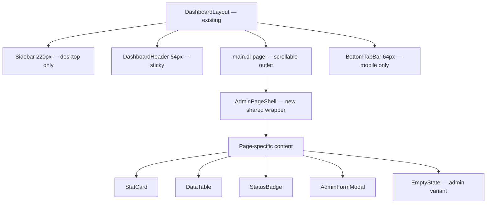
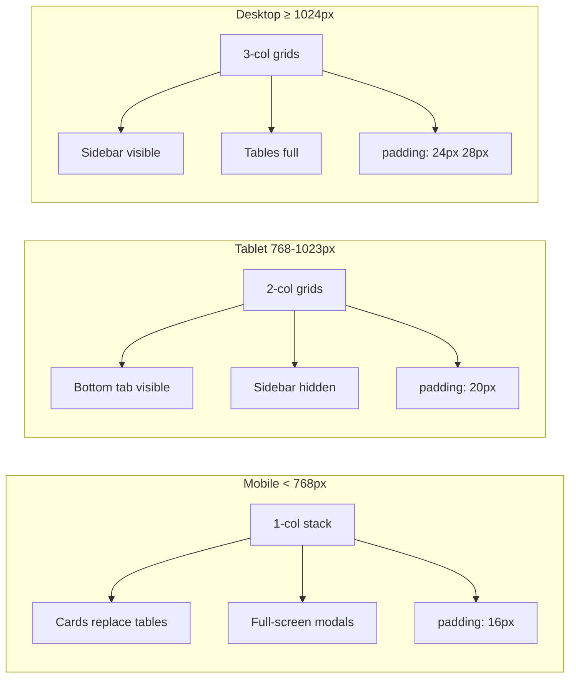
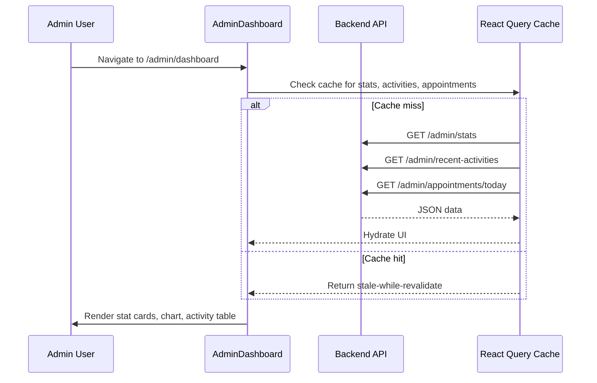
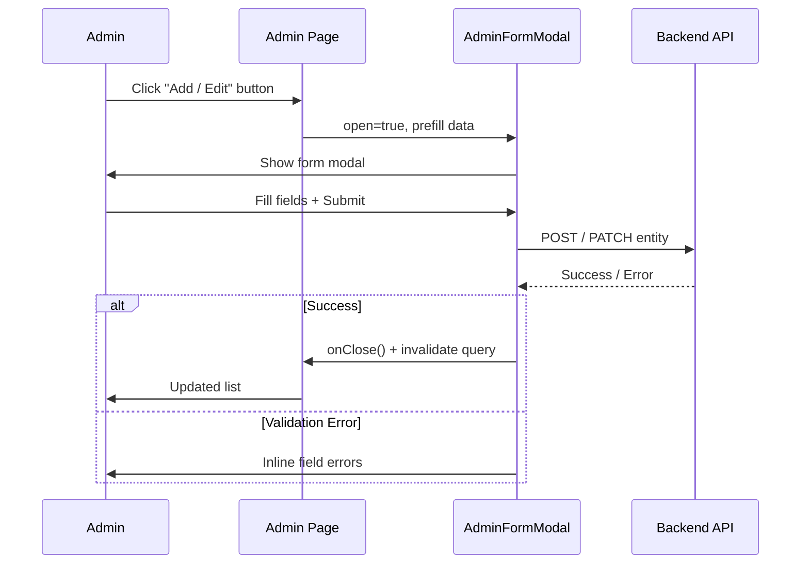

# Design Document: Admin Dashboard — Clinical Vitality

## Overview

The Admin Dashboard is a full-featured management interface for the **Clinical Vitality** nutrition and healthcare web application. It provides administrators with real-time operational oversight across patients, interns, appointments, revenue, and content (packages, services, blog, digital products, courses).

The UI follows the established project design language: dark teal sidebar (`#0f3d4a`), white card surfaces with subtle shadows, Inter typography, and teal (`#1a6b7a`) as the primary action color. All ten admin pages share a consistent shell, shared component library, and responsive grid strategy — sidebar on desktop (≥1024 px), bottom tab bar on mobile/tablet.

The design targets three personas: the practice owner reviewing revenue and KPIs on the main dashboard, the admin staff managing day-to-day patients and appointments on mobile, and a content manager publishing blog posts and digital products.

---

## Architecture

### Overall Layout Hierarchy



The existing `DashboardLayout` is unchanged. All admin pages render inside the `<Outlet />` and use the new `AdminPageShell` wrapper for consistent page framing.

### Responsive Grid Strategy



---

## Components and Interfaces

### Shared Admin Components — `src/components/admin/`

#### 1. `AdminPageShell.tsx`

Wraps every admin page with consistent title bar, subtitle, action slot, and responsive padding.

**Interface:**
```typescript
interface AdminPageShellProps {
  title: string
  subtitle?: string
  /** Buttons/controls rendered top-right */
  actions?: React.ReactNode
  children: React.ReactNode
  /** Max content width — defaults to '100%' for full-bleed tables */
  maxWidth?: string
}
```

**Responsibilities:**
- Applies `padding: '16px'` on mobile, `'24px 28px'` on desktop via CSS class
- Renders `<h1>` in `navy` + optional subtitle in `muted`
- `actions` slot floats right, wraps gracefully on mobile
- No max-width constraint by default (tables need full width)

**Visual structure:**
```
┌──────────────────────────────────────────────────┐
│ Page Title                    [Action Button(s)] │
│ Subtitle text (muted)                            │
├──────────────────────────────────────────────────┤
│  children                                        │
└──────────────────────────────────────────────────┘
```

#### 2. `StatCard.tsx`

Metric summary card used in dashboard overview rows.

**Interface:**
```typescript
interface StatCardProps {
  icon: React.ReactNode
  label: string
  value: string | number
  trend?: {
    value: number   // e.g. 12
    label: string   // e.g. "increase this month"
    up: boolean     // true = green arrow up, false = red arrow down
  }
  accentColor?: string  // defaults to COLORS.brand
  linkLabel?: string    // e.g. "View Schedule"
  onLink?: () => void
}
```

**Responsibilities:**
- White card, `borderRadius: 16px`, `boxShadow: SHADOW.card`
- Icon in a `40×40` circle with `brandLight` background, icon stroke in `brand`
- `value` in `navy`, `fontWeight: 700`, `fontSize: '1.5rem'`
- `trend` renders a small colored arrow + text below value
- `linkLabel` renders a small teal hyperlink below trend

**Visual:**
```
┌────────────────────────────┐
│ [Icon]  Label              │
│         1,284              │
│         ↑ 12% this month   │
│         View Schedule →    │
└────────────────────────────┘
```

#### 3. `StatusBadge.tsx`

Pill-shaped status indicator reused across all pages.

**Interface:**
```typescript
type BadgeStatus =
  | 'active' | 'inactive'
  | 'pending' | 'completed' | 'cancelled'
  | 'approved' | 'rejected'
  | 'published' | 'draft'

interface StatusBadgeProps {
  status: BadgeStatus
}
```

**Color mapping:**
```typescript
const STATUS_COLORS: Record<BadgeStatus, { bg: string; text: string; label: string }> = {
  active:     { bg: '#dcfce7', text: '#16a34a', label: 'Active' },
  approved:   { bg: '#dcfce7', text: '#16a34a', label: 'Approved' },
  completed:  { bg: '#dcfce7', text: '#16a34a', label: 'Completed' },
  published:  { bg: '#dcfce7', text: '#16a34a', label: 'Published' },
  pending:    { bg: '#fef3c7', text: '#d97706', label: 'Pending' },
  draft:      { bg: '#fef3c7', text: '#d97706', label: 'Draft' },
  inactive:   { bg: '#fee2e2', text: '#dc2626', label: 'Inactive' },
  cancelled:  { bg: '#fee2e2', text: '#dc2626', label: 'Cancelled' },
  rejected:   { bg: '#fee2e2', text: '#dc2626', label: 'Rejected' },
}
```

**Style:** `borderRadius: 999px`, `padding: '3px 10px'`, `fontSize: '11px'`, `fontWeight: 600`

#### 4. `DataTable.tsx`

Generic responsive table. Renders as `<table>` on desktop, as stacked cards on mobile.

**Interface:**
```typescript
interface Column<T> {
  key: string
  header: string
  width?: string
  render: (row: T) => React.ReactNode
  /** If true, column is hidden on mobile card view */
  hideOnMobile?: boolean
}

interface DataTableProps<T> {
  columns: Column<T>[]
  data: T[]
  /** Row key extractor */
  getKey: (row: T) => string
  /** Search: controlled externally */
  searchValue?: string
  onSearchChange?: (v: string) => void
  searchPlaceholder?: string
  /** Filter slot — renders to the right of search bar */
  filters?: React.ReactNode
  /** Empty state */
  emptyState?: React.ReactNode
  /** Pagination */
  page?: number
  pageSize?: number
  total?: number
  onPageChange?: (p: number) => void
  loading?: boolean
  /** If true, wraps table in a horizontally scrollable container on desktop */
  horizontalScroll?: boolean
}
```

**Responsibilities:**
- Search bar + filter slot in a flex row above the table
- Sticky `<thead>` with `background: white` on horizontal scroll containers
- Row hover: `background: #f8fbfc`
- On mobile (`< 768px`): each row renders as a white card with key-value pairs
- Pagination: prev/next buttons + page indicator, shows only when `total > pageSize`
- Loading state: skeleton rows (3 animated shimmer bars)

#### 5. `EmptyState.tsx` (admin variant)

```typescript
interface EmptyStateProps {
  icon: React.ReactNode
  title: string
  description: string
  action?: React.ReactNode
}
```

Centered vertically, icon in `40×40` `brandLight` circle, title in `navy`, description in `muted`. Matches patient-side `EmptyState` visually but lives in `src/components/admin/`.

#### 6. `AdminFormModal.tsx`

Slide-in or centered modal for create/edit forms. Built on `@radix-ui/react-dialog`.

**Interface:**
```typescript
interface AdminFormModalProps {
  open: boolean
  onClose: () => void
  title: string
  subtitle?: string
  children: React.ReactNode
  /** Rendered in fixed footer bar */
  footer?: React.ReactNode
  /** Controls max-width: sm=400 md=520 lg=720 */
  size?: 'sm' | 'md' | 'lg'
  /** If true, renders full-screen on all viewports */
  fullscreen?: boolean
}
```

**Behavior:**
- Desktop: centered, `maxWidth` per size, `borderRadius: 20px`, backdrop blur
- Mobile: full-screen (`width: 100vw, height: 100dvh, borderRadius: 0`) with header + scrollable body + sticky footer
- Footer has a divider above it, contains Cancel + Submit buttons
- Animation: scale-in on desktop, slide-up on mobile
- Closes on backdrop click (unless `loading` prop is set — future extension)

---

## Data Models

All models are already defined in `src/types/index.ts`. Admin pages consume them directly. Key types referenced:

```typescript
// Patient management
interface Patient { id, fullName, phoneNumber, email, gender, age, bloodGroup, createdAt, ... }

// Intern management
interface Intern { id, fullName, email, universityName, specialization, semester, year, isApproved, ... }

// Appointments
interface Appointment { id, patientName, date, slot, status: AppointmentStatus, ... }
type AppointmentStatus = 'pending' | 'confirmed' | 'completed' | 'cancelled' | 'rescheduled'

// Packages
interface Package { id, name, category: PackageCategory, duration, price, features[], isActive }
// Note: admin needs 3 price tiers (1M/3M/6M) — extend with:
interface AdminPackage extends Omit<Package, 'duration' | 'price'> {
  price1Month: number
  price3Months: number
  price6Months: number
}

// Digital Products
interface DigitalProduct { id, title, description, price, fileUrl, thumbnailUrl, category, isActive, createdAt }

// Courses
interface Course { id, title, description, eligibility, videos: CourseVideo[], hasTest, isActive }

// Services
interface Service { id, type: ServiceType, name, description, price, slots[], isActive }

// Revenue (new — not yet in types)
interface RevenueRecord {
  id: string
  date: string
  patientName: string
  type: 'consultation' | 'package' | 'digital_product'
  amount: number
  paymentMethod: string
  status: 'paid' | 'pending' | 'refunded'
}
```

---

## Sequence Diagrams

### Admin Dashboard Load Flow



### Create/Edit Form Modal Flow



---

## Algorithmic Pseudocode

### Main Processing Algorithms

#### AdminPageShell — Responsive Padding Resolution

```pascal
PROCEDURE resolvePagePadding(viewportWidth)
  INPUT: viewportWidth (number, px)
  OUTPUT: padding (string, CSS value)

  IF viewportWidth < 768 THEN
    RETURN '16px'
  ELSE IF viewportWidth < 1024 THEN
    RETURN '20px 20px'
  ELSE
    RETURN '24px 28px'
  END IF
END PROCEDURE
```

**Preconditions:** `viewportWidth > 0`
**Postconditions:** Returns a valid CSS padding string

#### DataTable — Mobile Card vs Table Rendering

```pascal
PROCEDURE renderDataTable(columns, data, isMobile)
  INPUT: columns (Column[]), data (T[]), isMobile (boolean)
  OUTPUT: React element tree

  IF isMobile THEN
    FOR each row IN data DO
      RENDER card
        FOR each column IN columns WHERE hideOnMobile = false DO
          RENDER key-value pair (column.header : column.render(row))
        END FOR
      END RENDER card
    END FOR
  ELSE
    RENDER table
      RENDER thead
        FOR each column IN columns DO
          RENDER th with column.header, width
        END FOR
      END RENDER thead
      RENDER tbody
        FOR each row IN data DO
          RENDER tr with hover style
            FOR each column IN columns DO
              RENDER td with column.render(row)
            END FOR
          END RENDER tr
        END FOR
      END RENDER tbody
    END RENDER table
  END IF
END PROCEDURE
```

**Loop Invariant:** All rendered columns correspond to a defined `Column<T>` entry; `render(row)` is called exactly once per cell.

#### StatusBadge — Color Resolution

```pascal
FUNCTION resolveStatusColor(status)
  INPUT: status (BadgeStatus)
  OUTPUT: { bg: string, text: string, label: string }

  SWITCH status DO
    CASE 'active', 'approved', 'completed', 'published':
      RETURN { bg: '#dcfce7', text: '#16a34a', label: capitalize(status) }
    CASE 'pending', 'draft':
      RETURN { bg: '#fef3c7', text: '#d97706', label: capitalize(status) }
    CASE 'inactive', 'cancelled', 'rejected':
      RETURN { bg: '#fee2e2', text: '#dc2626', label: capitalize(status) }
    DEFAULT:
      RETURN { bg: '#f0f4f6', text: '#6b8896', label: status }
  END SWITCH
END FUNCTION
```

**Postcondition:** Always returns a three-field object; never throws for any valid `BadgeStatus`.

---

## Key Functions with Formal Specifications

### `AdminPageShell` — Page Wrapper

```typescript
function AdminPageShell(props: AdminPageShellProps): JSX.Element
```

**Preconditions:**
- `props.title` is a non-empty string
- `props.children` is a valid React node tree

**Postconditions:**
- Renders a scrollable page container with correct padding for current viewport
- `title` is rendered as an `<h1>` accessible heading
- If `actions` is provided, it is rendered in a flex row opposite the title
- No horizontal overflow occurs at any viewport width

### `StatCard` — KPI Metric Card

```typescript
function StatCard(props: StatCardProps): JSX.Element
```

**Preconditions:**
- `props.value` is a string or non-negative number
- If `trend` is provided, `trend.value` is between 0–999

**Postconditions:**
- Card is fully visible and non-overflowing at viewport widths ≥ 280px
- If `trend.up === true`, arrow and text render in green (`#16a34a`)
- If `trend.up === false`, arrow and text render in red (`#dc2626`)
- `onLink` is only called when `linkLabel` is also provided and user clicks it

**Loop Invariants:** N/A (no loops)

### `DataTable` — Generic Responsive Table

```typescript
function DataTable<T>(props: DataTableProps<T>): JSX.Element
```

**Preconditions:**
- `props.columns` has at least 1 entry
- Every `column.render` is a pure function with no side effects
- `props.getKey` returns a unique string for each row

**Postconditions:**
- On desktop: renders a `<table>` with correct `<thead>`/`<tbody>` structure
- On mobile: renders one card per data row, showing only non-`hideOnMobile` columns
- When `data` is empty and `emptyState` is provided, renders `emptyState` centered
- When `loading === true`, renders 3 shimmer skeleton rows instead of data
- Pagination controls only render when `total > pageSize`
- Search input calls `onSearchChange` on every keystroke (debounce is caller's responsibility)

**Loop Invariants:**
- Column iteration: `index` advances monotonically from `0` to `columns.length - 1`
- Row iteration: each row is rendered exactly once, `getKey` returns distinct values

### `AdminFormModal` — CRUD Form Dialog

```typescript
function AdminFormModal(props: AdminFormModalProps): JSX.Element
```

**Preconditions:**
- `props.title` is a non-empty string
- When `props.open === true`, `props.children` must be a valid form subtree

**Postconditions:**
- When `open === false`, nothing is rendered to the DOM (Radix portal unmounts)
- On desktop: centered with max-width per `size`, backdrop blur applied
- On mobile: occupies full viewport height, body is independently scrollable
- `onClose` is called on backdrop click and on Escape key press
- `footer` (if provided) is always visible at the bottom, never scrolled away

---

## Screen Designs

### Screen 1: AdminDashboard (`/admin/dashboard`)

**Purpose:** Command-center overview for the practice — KPIs, revenue trend, recent activity, today's appointments.

**Layout (desktop):**
```
┌──────────────────────────────────────────────────────────────────┐
│ Practice Overview                    [Add Patient] [Create Pkg] │
│ Welcome back, Dr. Admin.                                         │
├──────────────────────────────────────────────────────────────────┤
│ [StatCard: Patients] [StatCard: Follow-ups] [StatCard: Interns] [StatCard: Today's Appts] │
├───────────────────────────────────────┬──────────────────────────┤
│ Revenue Growth chart (2/3 width)      │ Upcoming Appointments    │
│  ┌──────────────────────────────────┐ │ (1/3 width)              │
│  │ SVG area chart skeleton          │ │ Appointment cards list   │
│  │ Consultations vs Package Sales   │ │ (colored left border)    │
│  └──────────────────────────────────┘ │                          │
├───────────────────────────────────────┴──────────────────────────┤
│ Recent Activities table (full width)                             │
│  Patient | Action | Status | Time                                │
└──────────────────────────────────────────────────────────────────┘
```

**Stat Cards row:** 4-column grid on desktop, 2-column on tablet, 1-column on mobile.

**Revenue Chart:** SVG-based area chart placeholder (no recharts dependency). Two colored areas (brand teal for Consultations, amber for Package Sales). Time filter dropdown: This Week / Last 6 Months / This Year. Legend beneath. Chart data fed from mock/API array of `{ month, consultations, packages }`.

**Recent Activities table columns:**
- Patient (avatar circle + name)
- Action (e.g. "Diet Plan Uploaded", "Appointment Booked")
- Status (`StatusBadge`)
- Time (relative, e.g. "2 hrs ago")

**Upcoming Appointments list:**
Each item is a card with `borderLeft: '3px solid'` (teal=confirmed, amber=pending, red=cancelled), showing date badge, patient name, time slot, appointment type, and two icon buttons (Start Call, Details).

### Screen 2: AdminPatientsPage (`/admin/patients`)

**Purpose:** Full patient roster management with search, filter, add/edit/delete.

**Layout:**
```
┌──────────────────────────────────────────────────────┐
│ Patient Management                    [Add Patient]  │
│ Manage all registered patients                       │
├────────────────────────────────────────────────────  │
│ [Search bar] [Status ▼] [Blood Group ▼] [Date ▼]    │
├──────────────────────────────────────────────────────┤
│ DataTable (desktop) / Card list (mobile)             │
│  Avatar+Name | Email | Phone | Blood Grp | Status    │
│              | Joined | [View] [Edit] [Delete]       │
└──────────────────────────────────────────────────────┘
```

**Mobile card fields shown:** Name (bold), phone, status badge, joined date, action buttons row.

**Add/Edit modal (size: 'md'):**
Form fields: `fullName`, `email`, `phoneNumber`, `whatsappNumber`, `gender` (select), `bloodGroup` (select), `age`, `heightCm`, `weightKg`, `location`, `isDefencePersonnel` (toggle). Uses existing `FormField` + `SelectField`.

**Delete:** Triggers existing `ConfirmModal` with `variant: 'danger'`.

### Screen 3: AdminInternsPage (`/admin/interns`)

**Purpose:** Intern roster with approval workflow and course progress tracking.

**Layout:**
```
┌──────────────────────────────────────────────────────┐
│ Intern Management                     [Add Intern]   │
├─────────────────────────────────────────────────────-┤
│ [StatCard: Total] [Approved] [Pending] [Completed]  │
├──────────────────────────────────────────────────────┤
│ [Search] [Approval Status ▼]                         │
│ DataTable: Avatar+Name | University | Specialization │
│   Semester/Yr | Status badge | Progress bar | Actions│
└──────────────────────────────────────────────────────┘
```

**Stats row:** 4 cards — Total Interns, Approved, Pending Approval, Completed Courses.

**Progress bar:** horizontal bar in `brandLight` fill, `brandMid` progress. Width `120px` on desktop. Hidden on mobile card view.

**Add/Edit modal fields:** `fullName`, `email`, `phoneNumber`, `universityName`, `specialization`, `semester` (number), `year` (number), `isApproved` (toggle switch using `@radix-ui/react-switch`).

### Screen 4: AdminAppointmentsPage (`/admin/appointments`)

**Purpose:** Full appointment management with tabbed status filtering.

**Layout:**
```
┌──────────────────────────────────────────────────────┐
│ Appointments          [Date Picker] [+ New Appt]     │
├──────────────────────────────────────────────────────┤
│ [All] [Today] [Upcoming] [Completed] [Cancelled]     │
├──────────────────────────────────────────────────────┤
│ [Search patient] [Status ▼]                          │
│ DataTable / Card list                                │
│  Patient | Date & Time | Type | Status | Actions    │
│  (Confirm) (Reschedule) (Cancel) (View)             │
└──────────────────────────────────────────────────────┘
```

**Tab bar:** Pill-style tabs, active tab gets `brand` background + white text, others get `divider` background + `body` text.

**Mobile card:** Shows patient name (bold), date+time, type badge, status badge, action row (icon buttons only to save space).

**Actions:** Confirm → `ConfirmModal` (success variant), Cancel → `ConfirmModal` (danger variant).

### Screen 5: PackagesManagementPage (`/admin/packages`)

**Purpose:** Create and manage healthcare subscription packages.

**Layout:**
```
┌──────────────────────────────────────────────────────┐
│ Packages                            [Create Package] │
├──────────────────────────────────────────────────────┤
│ Card grid (3 cols desktop / 2 tablet / 1 mobile)    │
│  ┌──────────────────────┐                            │
│  │ [Category badge]     │                            │
│  │ Package Name         │                            │
│  │ ₹1M / ₹3M / ₹6M     │                            │
│  │ Description excerpt  │                            │
│  │ [Active toggle] [Edit] [Delete]                  │
│  └──────────────────────┘                            │
└──────────────────────────────────────────────────────┘
```

**Category badges:** Thyroid (blue), Diabetes (amber), Weight Loss (green), General (teal), Other (gray).

**Pricing row:** Three small pill chips showing `1M: ₹X`, `3M: ₹X`, `6M: ₹X` in `brandLight` bg.

**Create/Edit modal (size: 'lg'):**
Fields: `name`, `category` (select), `description` (textarea), `price1Month`, `price3Months`, `price6Months` (number inputs), features list (tag-style add/remove chip UI), `isActive` (switch).

### Screen 6: DigitalProductsPage (`/admin/digital-products`)

**Purpose:** Manage ebooks, diet guides, and recipe books for sale.

**Layout:**
```
Card grid (same 3/2/1 pattern as packages)
  ┌──────────────────────┐
  │ [Thumbnail 16:9]     │
  │ [Category badge]     │
  │ Title                │
  │ ₹Price               │
  │ [Status badge]       │
  │ [Edit] [Delete]      │
  └──────────────────────┘
```

**Thumbnail:** `borderRadius: '10px'`, `objectFit: 'cover'`, `height: 140px`. Fallback: gray placeholder with `FileText` icon.

**Add/Edit modal fields:** `title`, `description` (textarea), `price`, `category` (ebook / diet_guide / recipe_book), `status` (published / draft), file upload button (shows filename when selected), thumbnail upload button.

### Screen 7: CourseManagementPage (`/admin/courses`)

**Purpose:** Manage intern training courses, videos, and eligibility.

**Layout:**
```
┌──────────────────────────────────────────────────────┐
│ Course Management                      [Add Course]  │
├──────────────────────────────────────────────────────┤
│ Course cards grid (3/2/1)                            │
│  ┌──────────────────────────────┐                    │
│  │ Title                        │                    │
│  │ Description excerpt          │                    │
│  │ Eligibility: Sem 3+ / Yr 2+  │                    │
│  │ [🎥 X videos] [Test badge]   │                    │
│  │ [Active toggle]              │                    │
│  │ [View] [Edit] [Delete]       │                    │
│  └──────────────────────────────┘                    │
└──────────────────────────────────────────────────────┘
```

**Course Detail Panel:** On "View" click, renders a full-page detail view (not a modal) with:
- Video list with drag-to-reorder UI (or numbered order arrows ↑↓)
- Add video form: title, URL, duration
- Eligibility section: min semester/year sliders
- `hasTest` toggle
- "Issue Certificates" action button

**Add/Edit modal (size: 'md'):** `title`, `description`, `minSemester`, `minYear`, `hasTest` toggle, `isActive` toggle.

### Screen 8: ServicesManagementPage (`/admin/services`)

**Purpose:** CRUD for Yoga, Zumba, Blood Test services with slot management.

**Layout:**
```
Card grid (3/2/1)
  ┌──────────────────────────────┐
  │ [Service icon in circle]     │
  │ Service Name                 │
  │ [Type badge: yoga/zumba/...] │
  │ ₹Price                       │
  │ X available slots            │
  │ [Active toggle] [Edit] [Del] │
  └──────────────────────────────┘
```

**Service icons:** Yoga → `PersonStanding`, Zumba → `Music`, Blood Test → `Droplets` (all from lucide-react), rendered in a `50×50` `brandLight` circle.

**Add/Edit modal fields:** `name`, `type` (select: yoga/zumba/blood_test), `description`, `price`, slots (tag-input: type a time slot and press Enter/comma to add, × to remove), `isActive` switch.

### Screen 9: BlogPage (`/admin/blog`)

**Purpose:** Manage blog posts and recipe articles.

**Layout:**
```
┌──────────────────────────────────────────────────────┐
│ Blog & Recipes                       [Write Post]    │
├──────────────────────────────────────────────────────┤
│ [All] [Blog] [Recipe]  (filter tabs)                │
├──────────────────────────────────────────────────────┤
│ Post card grid (3/2/1)                               │
│  ┌──────────────────────────┐                        │
│  │ [Featured image 16:9]    │                        │
│  │ [Category badge]         │                        │
│  │ Title                    │                        │
│  │ Published: Jan 12, 2025  │                        │
│  │ [Status badge]           │                        │
│  │ [Edit] [Delete] [Preview]│                        │
│  └──────────────────────────┘                        │
└──────────────────────────────────────────────────────┘
```

**Write/Edit:** Full-page form (navigates to `/admin/blog/new` or `/admin/blog/:id/edit`), not a modal. Contains: title input, category select, featured image upload, rich-text editor placeholder (`<textarea>` with min-height `300px`; note for implementation: swap with Tiptap/Quill), tags input, publish/draft toggle, Save button.

### Screen 10: RevenuePage (`/admin/revenue`)

**Purpose:** Revenue analytics across all product types.

**Layout:**
```
┌──────────────────────────────────────────────────────┐
│ Revenue Analytics                                    │
├──────────────────────────────────────────────────────┤
│ [Total Rev] [Consultation Rev] [Package Rev] [Digital]│
├──────────────────────────────────────────────────────┤
│ Monthly Revenue Chart (full width)                   │
│  SVG bar/line chart, 12-month data                   │
│  Toggle: [Consultations] [Packages] [Digital]        │
├──────────────────────────────────────────────────────┤
│ Revenue Breakdown Table                              │
│  Date | Patient | Type | Amount | Method | Status   │
└──────────────────────────────────────────────────────┘
```

**Stat cards:** 4 cards — Total Revenue (all time), Consultation Revenue, Package Revenue, Digital Product Revenue — each with period comparison (e.g. "+18% vs last month").

**Revenue Chart:** SVG chart placeholder with grid lines and data points. Month labels on X axis, amount labels on Y axis. Toggle buttons filter the visible data series.

---

## Example Usage

### AdminPageShell with actions

```typescript
// AdminPatientsPage.tsx
import AdminPageShell from '@/components/admin/AdminPageShell'

export default function AdminPatientsPage() {
  const [modalOpen, setModalOpen] = useState(false)

  return (
    <AdminPageShell
      title="Patient Management"
      subtitle="Manage all registered patients"
      actions={
        <button
          onClick={() => setModalOpen(true)}
          style={{
            background: COLORS.brand,
            color: COLORS.white,
            borderRadius: '10px',
            padding: '9px 18px',
            fontSize: FONT_SIZE.sm,
            fontWeight: FONT_WEIGHT.semibold,
            border: 'none',
            cursor: 'pointer',
            display: 'flex',
            alignItems: 'center',
            gap: '6px',
          }}
        >
          <UserPlus size={16} />
          Add Patient
        </button>
      }
    >
      {/* page content */}
    </AdminPageShell>
  )
}
```

### StatCard usage

```typescript
// AdminDashboard.tsx
import StatCard from '@/components/admin/StatCard'
import { Users } from 'lucide-react'

<StatCard
  icon={<Users size={20} strokeWidth={1.8} />}
  label="Total Active Patients"
  value={1284}
  trend={{ value: 12, label: 'increase this month', up: true }}
  linkLabel="View All"
  onLink={() => navigate(ROUTES.ADMIN.PATIENTS)}
/>
```

### StatusBadge usage

```typescript
// In DataTable column render
import StatusBadge from '@/components/admin/StatusBadge'

const columns: Column<Patient>[] = [
  {
    key: 'status',
    header: 'Status',
    render: (row) => <StatusBadge status={row.accountStatus.toLowerCase() as BadgeStatus} />,
  },
]
```

### AdminFormModal usage

```typescript
// PackagesManagementPage.tsx
import AdminFormModal from '@/components/admin/AdminFormModal'

<AdminFormModal
  open={modalOpen}
  onClose={() => setModalOpen(false)}
  title={editingPackage ? 'Edit Package' : 'Create Package'}
  size="lg"
  footer={
    <div style={{ display: 'flex', gap: '10px', justifyContent: 'flex-end' }}>
      <button onClick={() => setModalOpen(false)}>Cancel</button>
      <button type="submit" form="package-form">Save Package</button>
    </div>
  }
>
  <PackageForm id="package-form" defaultValues={editingPackage} onSubmit={handleSubmit} />
</AdminFormModal>
```

---

## Correctness Properties

### Property 1: No Horizontal Overflow

For any viewport width w ≥ 280px, no admin page produces horizontal scroll or content clipping. All cards, tables (converted to card lists on mobile), and modals fit within the viewport bounds.

**Validates: Requirements 1.1**

### Property 2: Mobile Table-to-Card Conversion

For any viewport width w < 768px, the `DataTable` component renders card-based rows instead of a `<table>` element. No `<table>` element is present in the DOM on mobile viewports.

**Validates: Requirements 1.2**

### Property 3: Sidebar/BottomTabBar Mutual Exclusion

For any viewport width w < 1024px the Sidebar is hidden and `BottomTabBar` is visible. For w ≥ 1024px `BottomTabBar` is hidden and Sidebar renders at exactly 220px. These two states are mutually exclusive for all values of w.

**Validates: Requirements 1.3**

### Property 4: StatCard Trend Color Correctness

For any `StatCard` rendered with `trend.up === true`, the trend indicator color is `#16a34a` (green). For any rendered with `trend.up === false`, the color is `#dc2626` (red). No other color values are used for trend indicators.

**Validates: Requirements 2.1**

### Property 5: StatusBadge Exhaustiveness

For every value in the `BadgeStatus` union type, `StatusBadge` renders a non-empty label with a defined background color and text color from the palette. No `BadgeStatus` value produces an unstyled or empty badge.

**Validates: Requirements 2.2**

### Property 6: DataTable Row Count Invariant

For any `data` array of length N and `pageSize` P, the `DataTable` renders exactly `min(N, P)` row elements (either `<tr>` on desktop or card divs on mobile). When N = 0, the `emptyState` slot is rendered instead.

**Validates: Requirements 3.1**

### Property 7: DataTable Loading Skeleton

When `DataTable` receives `loading === true`, it renders exactly 3 shimmer skeleton rows and zero data row elements, regardless of the contents of `data`.

**Validates: Requirements 3.2**

### Property 8: AdminFormModal Portal Lifecycle

When `AdminFormModal` receives `open === false`, its Radix Dialog portal is unmounted from the DOM entirely. When `open === true`, the portal is mounted and the modal title is accessible via `role="dialog"`.

**Validates: Requirements 4.1**

### Property 9: AdminFormModal Footer Visibility

For any `AdminFormModal` with `footer` provided and `open === true`, the footer element is visible without scrolling on all viewport heights ≥ 480px. The modal body scrolls independently of the footer.

**Validates: Requirements 4.2**

### Property 10: Form Validation Before Mutation

For any admin form (patients, interns, packages, services, etc.), the API mutation function is never called when `zod` schema validation fails. All field errors are surfaced inline via `FormField`'s `error` prop before any network request is made.

**Validates: Requirements 5.1**

---

## Error Handling

### Error Scenario 1: API Data Fetch Failure

**Condition:** React Query fetch for dashboard stats, patient list, etc. returns an error.
**Response:** Page renders an inline error banner (amber background, warning icon, error message string) above the main content. The rest of the page structure remains visible.
**Recovery:** "Retry" button in the banner calls `refetch()` from the query. No page reload required.

### Error Scenario 2: Form Validation Failure

**Condition:** User submits a modal form with missing required fields or invalid values.
**Response:** `react-hook-form` + `zod` resolver surfaces per-field error messages via the existing `FormField` `error` prop. The submit button remains enabled but shows a spinner during mutation.
**Recovery:** User corrects fields and resubmits. No modal close/reopen cycle needed.

### Error Scenario 3: CRUD Mutation Failure

**Condition:** Create/Edit/Delete API call returns a non-2xx response.
**Response:** Modal remains open. Error message appears as a red banner inside the modal footer area. Specific field errors from API (if `errors` map provided in `ApiError`) are mapped back to fields.
**Recovery:** User reads the error, corrects data if needed, resubmits.

### Error Scenario 4: Delete of In-Use Entity

**Condition:** Admin tries to delete a Package or Service that has active appointments/patients attached.
**Response:** Backend returns 409 Conflict. `ConfirmModal` has already been dismissed (mutation was called). A toast notification (using `@radix-ui/react-toast`) appears with the conflict message.
**Recovery:** Admin must deactivate the entity (toggle `isActive` off) rather than deleting it.

### Error Scenario 5: Empty State (No Data)

**Condition:** A page loads with zero records (e.g. no patients yet, no blog posts).
**Response:** `DataTable` / card grid renders the `EmptyState` component with contextual icon, title, and CTA button pointing to the add action.
**Recovery:** CTA button opens the Add modal directly.

---

## Testing Strategy

### Unit Testing Approach

Each shared admin component should have isolated unit tests covering:

- **`StatusBadge`:** Render test for every possible `status` value confirming correct label text and that background/text color CSS variables are applied.
- **`StatCard`:** Render with and without `trend`, with `linkLabel`, with custom `accentColor`. Confirm no overflow at small widths (JSDOM mock).
- **`AdminFormModal`:** Confirm portal not in DOM when `open=false`; confirm title renders when `open=true`; confirm `onClose` called on Escape key.
- **`AdminPageShell`:** Confirm `<h1>` contains the `title` prop; confirm `actions` slot renders its children.

### Property-Based Testing Approach

**Property Test Library:** `fast-check` (to be installed as devDependency)

Key properties to test:

1. **`StatusBadge` exhaustiveness:** For any `BadgeStatus` value, `resolveStatusColor` always returns a non-empty `bg` and `text` string.
2. **`DataTable` row count:** For any array of N items (0–1000), the rendered row/card count equals `Math.min(N, pageSize)`.
3. **`StatCard` value display:** For any non-negative number or string value, the rendered output contains that value as a substring with no truncation at default card width.
4. **Responsive padding:** For any integer viewport width in [280, 2560], `resolvePagePadding` returns a string matching the CSS padding pattern `^[\d]+(px)`.

### Integration Testing Approach

- **Modal open/close cycle:** Mount `AdminFormModal` inside a parent component, simulate open → fill form → submit → close, assert query invalidation was called.
- **DataTable search:** Mount with mock data, type in search input, assert filtered rows update (assumes `onSearchChange` + external filtering).
- **Delete flow:** Mount a page with mocked `ConfirmModal`, simulate delete click → confirm → assert API mutation called once with correct ID.

---

## Performance Considerations

- All admin pages use React Query with `staleTime: 30_000` (30 seconds) to avoid redundant refetches during navigation.
- `DataTable` implements `pageSize: 20` pagination by default — never renders all records at once.
- SVG charts use pure DOM rendering (no canvas) — lightweight, no extra bundle weight.
- `AdminFormModal` unmounts its portal when `open=false`, keeping DOM lean.
- Images (thumbnails, avatars) use `loading="lazy"` and `object-fit: cover` to avoid layout shift.
- No recharts or heavy chart library is introduced — keeping the bundle at its current size.

---

## Security Considerations

- All admin routes are wrapped in `ProtectedRoute` (existing) which validates `role === 'ADMIN'` from `authStore`.
- File upload fields display only the filename — never the raw file object URL in the DOM.
- Form inputs use `zod` validation before any API call — prevents sending malformed data.
- Delete actions always require a two-step confirmation via `ConfirmModal` — prevents accidental data loss.
- Patient PII (email, phone) in tables is never displayed in URL parameters or console logs.

---

## Dependencies

All dependencies already present in `package.json`:

| Dependency | Usage |
|---|---|
| `react` + `react-dom` v19 | UI framework |
| `react-router-dom` v7 | Navigation, `<Outlet>` |
| `@tanstack/react-query` v5 | Data fetching & cache |
| `zustand` | `authStore` for current user |
| `@radix-ui/react-dialog` | `AdminFormModal` + `ConfirmModal` |
| `@radix-ui/react-switch` | Toggle fields in forms |
| `@radix-ui/react-tabs` | Appointment tab bar |
| `@radix-ui/react-toast` | Error/success notifications |
| `lucide-react` | All icons throughout admin pages |
| `react-hook-form` | Form state management |
| `@hookform/resolvers` + `zod` v4 | Schema validation |
| `date-fns` | Date formatting in tables/charts |
| `tailwind-merge` + `clsx` | Conditional className utility |

**No new dependencies required.** The SVG chart approach avoids adding recharts or chart.js.
